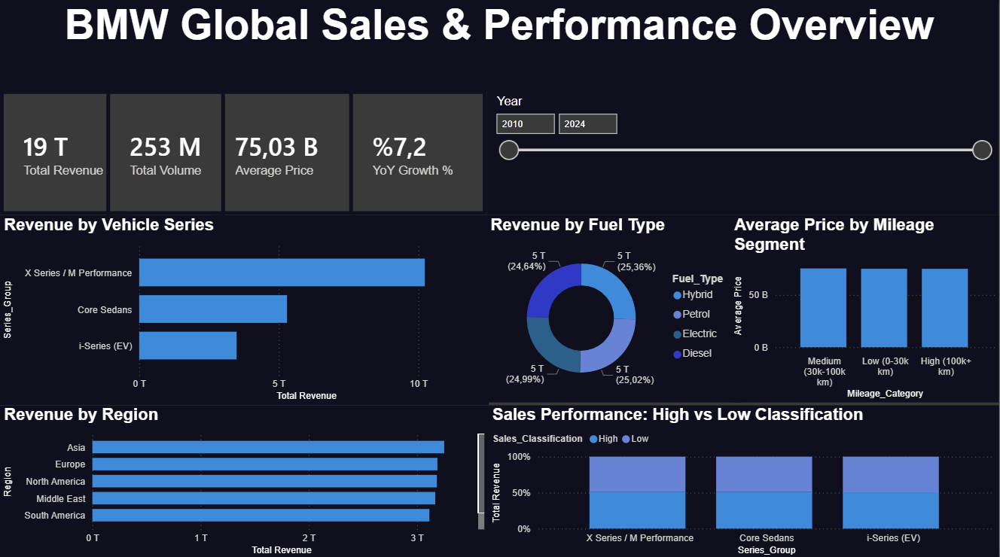

# BMW Global Sales & Performance Dashboard

An interactive Power BI dashboard analyzing BMW global sales data (2010–2024), 
built with a full data pipeline: Python for cleaning & feature engineering, 
Google BigQuery for SQL analysis, and Power BI for visualization.

## 🛠️ Tools & Workflow

1. **Python (Pandas)** — data quality checks, outlier flagging (IQR method), 
   and feature engineering (`Series_Group`, `Revenue`, `Car_Age`, `Mileage_Category`)
2. **Google BigQuery** — SQL-based aggregation and trend analysis
3. **Power BI** — Star schema data modeling, DAX measures, interactive dashboard

## 📊 Key Findings

- **Revenue by Series:** X Series / M Performance leads with ~54% of total revenue, 
  followed by Core Sedans (~28%) and i-Series EV (~18%)
- **Sales Classification:** "High" performing sales consistently generate ~2.4x 
  more revenue than "Low" performing sales, across all series
- **Fuel Type, Region, and Year-over-Year trends** show a balanced/flat distribution 
  in this dataset — no significant EV adoption curve or regional concentration was found, 
  reported transparently rather than overstated

## 📁 Files

- `Bmw_Feature_Engineering.ipynb` — Python data cleaning & feature engineering
- `BMW SQL.txt` — BigQuery SQL queries used for analysis
- `BMW PowerBI.pbix` — Power BI dashboard file
- `Dashboard.png` — dashboard preview

## 📈 Dashboard Features

- Total Revenue, Volume, Average Price, and YoY Growth KPI cards
- Year range slicer for time-based filtering
- Revenue breakdown by vehicle series, fuel type, and region
- Sales classification performance comparison
- Price behavior across mileage segments

---
📩 Feel free to connect for details on the SQL queries, DAX measures, or the full pipeline.
